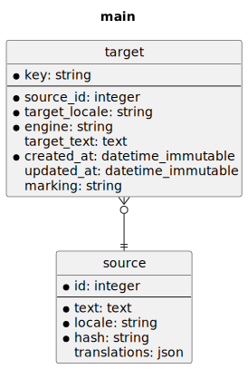

# Survos Translation Server

Conslidated translations for Survos projects.  Translations are submitted via the poorly-named survos/libre-translate-bundle

## Database

## Workflow

* Source strings are uploaded.
* Target entities are generated with marking=new
* TargetMessage is queued via messenger

